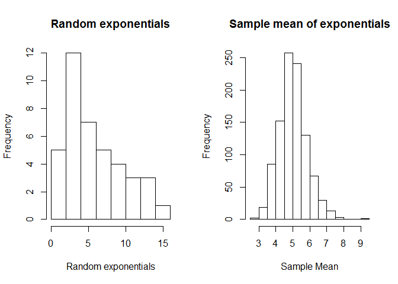

In this report, the author will study on exponential distribution by performing sampling simulation and furthermore demonstrate the central limit theorem.

#Simulation Exercise on Exponential Distribution
The mean of exponential distribution is 1/lambda and the standard deviation is also 1/lambda. The project description set lambda = 0.2. Therefore the theoretical mean and standard deviation of the exponential distribution are 5.0.  

##1.1. Sample mean vs. Theoretical mean of Exponential Distribution  

In this module, I will perform 1000 number of simulatio to show the sample mean of 40 exponentials. I will display the result of the simulation as a histogram and compare the sample mean to the theoretical mean, 0.5. 

```r
# Load knitr library
library(knitr)
# Lambda is 0.2 and sample size n=40. Perform simulation by sampling 40 exponential distribution for 10000 times. Print out the simulated sample mean and compare with the theoretical mean.
lambda = 0.2
n = 40
exphist = NULL
for (i in 1:1000) exphist = c(exphist, mean(rexp(n, lambda)))
samplemean = mean(exphist)
print(paste('Sample mean: ', samplemean))
```

```
## [1] "Sample mean:  5.00943582884062"
```
As we can observe the sample mean from the simulation is very close to the theoretical mean of exponential distribution, 5.0. Therefore, sample mean is a good estimator for the theoretical (population) mean of the exponential distribution.  
  
  
##1.2. Sample variance vs. Theoretical variance of the Sample Distribution  
In this module, I will quantify how variable the sample is by calculating the variance of the sample distribution. This variance should be close to the square of standard error which is the theoretical variance of the distribution.

```r
# Use the simulation performed above. Print out the simulated sample variance and compare with the theoretical sample variance.
sampledistvariance = sd(exphist)^2
standarderror = (1/lambda)^2/n
print(paste('Variance of sample distribution: ', sampledistvariance))
```

```
## [1] "Variance of sample distribution:  0.666582756296711"
```

```r
print(paste('Theoretical variance (standard error) of sample distribution: ', standarderror))
```

```
## [1] "Theoretical variance (standard error) of sample distribution:  0.625"
```
  
As we can observe, the sample variance from the simulation is very close to the theoretical variance of sample distribution, 0.625. 

##1.3. Demonstration of Central Limit Theorem  
In this module, I will demonstrate the central limit theorem. CLT establishes that sample distribution of any independent random variable tends toward a normal distribution even if the original variables themselves are not normally distributed. This fact holds true especially for big sample size (n>30). Using R, I will compare the distribution of a large collection of random exponentials and the distribution of a large collection of averages of 40 exponentials.

```r
# Display the histograms of a large collection of random exponentials and the distribution of a large collection of averages of 40 exponentials.
par(mfrow=c(1,2))
hist(rexp(n, lambda), main ="Random exponentials", xlab = "Random exponentials" )
hist(exphist, main="Sample mean of exponentials", xlab = "Sample Mean")
```

<!-- -->
  
As we can observe, the sample mean distribution forms normal distribution due to the CLT. Random exponential is not normally distribution because the sample size n is 1 unlike the sample mean distribution with n=40.

  
