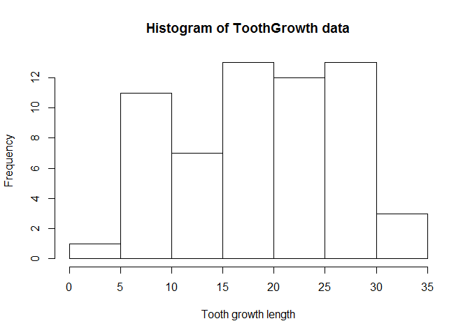
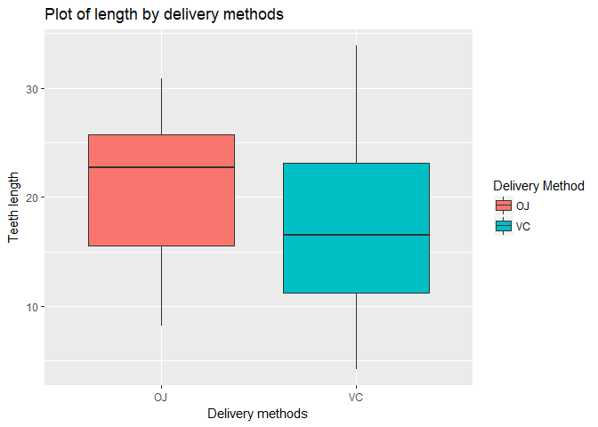
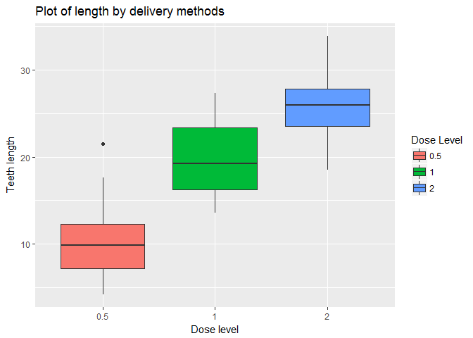

In this report, the author will perform exploratory and inferential data analysis on toothgrowth data.

# Part 2: Inferential Data Analysis on TootGrowth data in the R dataset package.

##2.1. Exploratory data analysis on ToothGrowth data
This exploratory data analysis will check the normality of the legnth data. Then will show side-to-side boxplot of the data grouped by delivery method and by dose. There are two delivery methods: Vitamin C for VC and Oragne Juice for OJ. There are three dose levels of vitamin C: 0.5, 1, 2 mg/day.

```r
# Load TootGrowth data
data <- ToothGrowth
# Histograme of the tooth length data
hist(data$len, main = "Histogram of ToothGrowth data", xlab = "Tooth growth length")
# Import ggplot package
library(ggplot2)
```

<!-- -->

```r
# Boxplot of tooth length grouped by delivery methods
ggplot(aes(y=data$len, x = data$supp, fill = data$supp), data = ToothGrowth) + geom_boxplot()+labs(title="Plot of length by delivery methods", x ="Delivery methods", y = "Teeth length")+ scale_fill_discrete(name = "Delivery Method")
```

<!-- -->

```r
# Boxplot of tooth length grouped by dose levels
ggplot(aes(y=data$len, x = factor(data$dose), fill = factor(data$dose)), data = ToothGrowth) + geom_boxplot()+labs(title="Plot of length by delivery methods", x ="Dose level", y = "Teeth length")+scale_fill_discrete(name = "Dose Level")
```

<!-- -->
  
For the histogram of the entire toothlength data, we can not observe the normality of the dataset. However we can see how the delivery methods and dose level affect the teeth length. The first boxplot hints that Orange juice delivery method tends to result longer teeth length growth. The second boxplot indicates that the dose level has positive relationship with teeth growth.

##2.2. Effect of the delivery method on tooth growth data
In this section, we will use two sample t-test to investigate whether different delivery methods result statistically significant difference on the tooth growth length.  
The null hypothesis will be that there is no significant difference in the tooth growth between two groups. For this testing, we are using 95% of confidence level and equal variance between two groups.

```r
# Sort Toothgrowth data by delivery method
VC <- subset(ToothGrowth, supp=='VC')$len
OJ <- subset(ToothGrowth, supp=='OJ')$len
t.test(VC, OJ, alternative = "two.sided", var.equal = FALSE)
```

```
## 
## 	Welch Two Sample t-test
## 
## data:  VC and OJ
## t = -1.9153, df = 55.309, p-value = 0.06063
## alternative hypothesis: true difference in means is not equal to 0
## 95 percent confidence interval:
##  -7.5710156  0.1710156
## sample estimates:
## mean of x mean of y 
##  16.96333  20.66333
```
  
From the two sample t-test, we can see that the p-value is bigger than the level of significance (0.06063 > 0.05). Therefore we fail to reject null hypothesis, and this indicates that there is no significant difference between the delivery method groups, VC and OJ.

##2.3. Effect of the dose level on tooth growth data
In this section, we will use two sample t-test to investigate whether different dose level result statistically significant difference on the tooth growth length.  
The null hypothesis will be that there is no significant difference in the tooth growth between two groups (dose level 0.5 and dose level 2). For this testing, we are using 95% of confidence level and equal variance between two groups.

```r
# Sort Toothgrowth data by delivery method
dose0.5 <- subset(ToothGrowth, dose==0.5)$len
dose2.0<- subset(ToothGrowth, dose==2)$len
t.test(dose0.5, dose2.0, alternative = "two.sided", var.equal = FALSE)
```

```
## 
## 	Welch Two Sample t-test
## 
## data:  dose0.5 and dose2.0
## t = -11.799, df = 36.883, p-value = 4.398e-14
## alternative hypothesis: true difference in means is not equal to 0
## 95 percent confidence interval:
##  -18.15617 -12.83383
## sample estimates:
## mean of x mean of y 
##    10.605    26.100
```
From the two sample t-test, we can see that the p-value is much smaller than the level of significance (4.398e-14 < 0.05). Therefore we successfully reject null hypothesis. This indicates that there is significant difference between the dose level groups.
