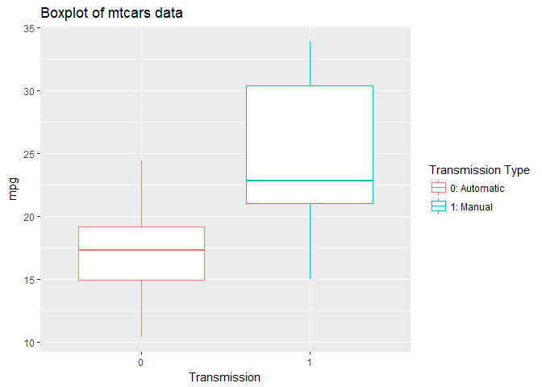
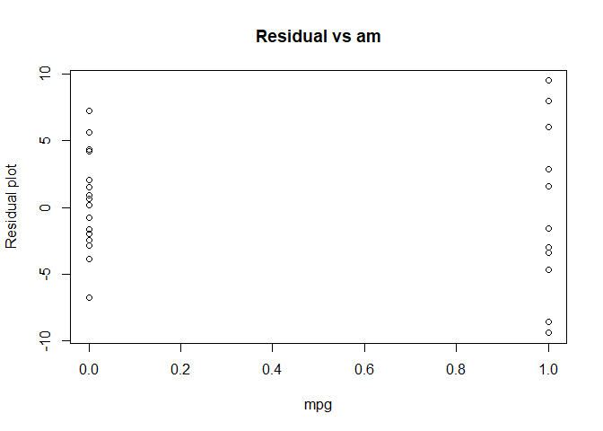

#Executive summary
In this report, the author investigated the relationship between MPG and transmission type that appears in mtcars dataset by answering two questions: 1. Is an automatic or manual transmission better for MPG, 2. Quantify the MPG difference between automatic and manual transmission. The linear regression model fitting was performed using transmission type as the predictor for mpg. The model indicates that the manual cars perform better in terms of mpg by 7.245 miles/gallon in average.
##Exploratory data analysis  
Following is an exploratory data analysis on the mtcar dataset. 

```r
# Load knitr library
library(knitr)
data(mtcars)
# Subset the data frame to have only "mpg" and "am" columns"
data <- mtcars[, c("mpg","am")]
# Summary of the mtcars
summary(data)
```

```
##       mpg              am        
##  Min.   :10.40   Min.   :0.0000  
##  1st Qu.:15.43   1st Qu.:0.0000  
##  Median :19.20   Median :0.0000  
##  Mean   :20.09   Mean   :0.4062  
##  3rd Qu.:22.80   3rd Qu.:1.0000  
##  Max.   :33.90   Max.   :1.0000
```

```r
# Observe the structure of the data
str(data)
```

```
## 'data.frame':	32 obs. of  2 variables:
##  $ mpg: num  21 21 22.8 21.4 18.7 18.1 14.3 24.4 22.8 19.2 ...
##  $ am : num  1 1 1 0 0 0 0 0 0 0 ...
```
We can observe various characteristics from the dataset. "mpg"" column has all the positive values with mean of 20.09. "am" is a binary variable: 0 means automatic and 1 means manual transmission type. We have 32 data points and each data point has information about mpg and transmission type.  
Furthermore, we can acquire a better understanding on the data by plotting the data. "mpg" will be the dependant variable and "am"" will be the categorical independant variable. The boxplot (Plot A of appendix) seems to suggest that manual transmission cars tend to have higher mpg than the automatic cars.  


##Linear regression model
###Model Fitting
Now we will fit linear regression model on mtcars dataset. Linear regression model is chosen as the first model to use because it is the most widely used and the result is easy to interpret. Furthermore the outcome is conitunous data, so it makes most sense to use linear regression model

```r
# Linear model fit
lmfit <- lm(mpg~am, data)
summary(lmfit)$coefficients
```

```
##              Estimate Std. Error   t value     Pr(>|t|)
## (Intercept) 17.147368   1.124603 15.247492 1.133983e-15
## am           7.244939   1.764422  4.106127 2.850207e-04
```
The linear regression result says that mpg = (17.127) + (7.245)*am. The intercept is the expected mpg when the transmission type is automatic. And the am coefficient means that mpg is expected to increase by 7.245 when the transmission is manual. The p-value for each coefficient is very low. Therefore transmission type is a meaningful variable to predict mpg. 
###Diagnostic analysis and limitations
However, the R-squared value on the summary of the linear regression model is quite low. It says that about 35% of the mpg variability is explained by the linear relationship with the am. Let's perform deeper diagnostic analysis on the model

```r
# lmfit coefficients confidence interval
confint(lmfit)
```

```
##                2.5 %   97.5 %
## (Intercept) 14.85062 19.44411
## am           3.64151 10.84837
```
The confidence interval for am coefficient is quite large. This is quite concerning because 97.5% value is three times the 2.5% value. The residual plot tells us that the residual values for manual transmission data points are centered around below zero unlike that of automatic transmission data points. Also the variance on the manual transmission is larger than the other which makes us to suspect heteroscedasticity. This tells us that this linear model is potentially underfitting and should explore for other predictors.

###Conclusion - Answering the initial questions
This study was initiated to answer the following questions: 1. Is an automatic or manual transmission better for MPG, 2. Quantify the MPG difference between automatic and manual transmission.  
To answer both of these questions, we should look back to the and the coefficient of the predictor. The sign of the coefficient is positive. This means that manual cars tends to yield better mpg than the automatic cars. Also the value 7.245 indicates that mpg is expected to increase by that amount when the car is manual. Granted, the confidence interval of the coefficient is quite big. However even at the lowest value in the interval the value 3.642 indicates that mpg is expected to be better by that amount for manual cars.

##Appendix
Plot A. Boxplot for explanatory data analysis

```r
library(ggplot2)
# Boxplot of the data
p <- ggplot(data, aes(x=as.factor(am), y=mpg, color=factor(am, labels = c("0: Automatic", "1: Manual")))) + geom_boxplot() + labs(title = "Boxplot of mtcars data")+ xlab("Transmission")+ylab("mpg")+labs(color="Transmission Type")
p
```

<!-- -->
Plot B. Residual plot for diagnostic analysis

```r
# Residual plot of lmfit model
plot(data$am, resid(lmfit), ylab="Residual plot", xlab="mpg", main = "Residual vs am")
```

<!-- -->
